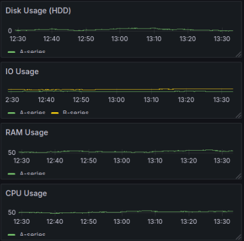

# Laboratorio Sistemas Operativos 1

# Primer Semestre

### Primer Semestre 2025

```js
Universidad San Carlos de Guatemala
Programador: Franklin Orlando Noj Pérez
Carne: 202200089
Correo: master11frank@gmail.com/ 3110022770701@ingenieria.usac.edu.gt
```

---

## El objetivo de este proyecto es aplicar todos los conocimientos adquiridos en la unidad 1, con la implementación de un gestor de contenedores mediante el uso de scripts, módulos de kernel, lenguajes de programación y la herramienta para la creación y manejo de contenedores más popular, Docker. Con la ayuda de este gestor de contenedores se podrá observar de manera más detallada los recursos y la representación de los contenedores a nivel de procesos de Linux y como de manera flexible pueden ser creados, destruidos y conectados por otros servicios

## Objetivos

- Objetivo General
  - Desarrollar un gestor de contenedores
- Objetivos Específicos
  - Conocer el Kernel de Linux mediante módulos de C.
  - Hacer uso del lenguaje de programación Rust para la gestión del sistema
  - Comprender el funcionamiento de los contenedores usando Docker


## Caracteristicas del programa

- Desarrollado en rust
- Uso de docker para la creacion de contenedores
- Uso de C
- Uso de grafana para la graficacion

---
## Tecnologias necesarias

- Docker
- Rust
- C
- Grafana
---


# Comandos para ver el Cronjob

- crontab -l  
    Con este comando se podra visualizar el contenido del cronjob
- crontab -e 
    Con este comando se podra editar el archivo crontab

# Comandos para subir los modulos al kernel
    - sudo insmod nombre

# Comando para ver si el kernel tiene modulos subidos
    - lsmod | grep nombre

# Comando para quitar un modulo de kernel
    - sudo rmmod nombre

# Comando para compilar modulo c
    - make

# Comando para limpiar compilacion del modulo c
    - make clean

# Comando para compilar codigo rust
    - cargo build

# Comando para limpiar compilado en rust
    - cargo clean

# Comando para correr compilado en rust
    - cargo run


# Ejemplo de como se muestran las graficas en grafana




# Módulo del Kernel: Monitorización de Contenedores
Este código es un **módulo del kernel de Linux** que recopila información del sistema y los contenedores en ejecución, mostrando los datos en **formato JSON** a través del sistema de archivos `/proc`.  

## Funcionalidades Principales

###  Recopilación de información de los contenedores
- **Identificación del contenedor:**  
  Se obtiene el `ID` del contenedor desde la línea de comandos (`cmdline`) del proceso que lo ejecuta (`containerd-shim`).
  
- **Uso de memoria:**  
  Se calcula sumando la **RSS (Resident Set Size)** del proceso y sus hijos.

- **Uso de CPU:**  
  Se suma el tiempo de CPU (`utime` + `stime`) consumido por el proceso y sus hijos.

- **Uso de I/O:**  
  Se recopila la cantidad de datos leídos y escritos en disco (`read_bytes` y `write_bytes`).

---

### Generación del JSON en `/proc/sysinfo`
La función `sysinfo_show` construye el JSON con:
- **Memoria RAM total, libre y usada.**
- **Uso total de CPU del sistema.**
- **Lista de contenedores con su uso de recursos.**

---

### Creación del archivo en `/proc`
El módulo crea `/proc/sysinfo` usando `proc_create()`.  
Cuando un usuario ejecuta:


cat /proc/sysinfo


```bash
# Monitorización de Contenedores en Rust

## Introducción
Este programa en **Rust** monitorea contenedores de **Docker**, analiza su uso de recursos y los envía a **Grafana** para visualización. Además, maneja contenedores en función de su tipo y los almacena en un archivo JSON persistente.

---

## 🛠️ Funcionalidades Principales

### 1. Lectura de Información del Sistema
- Se accede a `/proc/sysinfo` para obtener:
  - **RAM total, libre y usada**
  - **Uso total de CPU**
  - **Lista de contenedores con sus métricas**  
 **Función:** `read_proc_file()`

---

### 2. Obtención de Contenedores Docker
- Ejecuta `docker ps -a --format` para listar contenedores.
- Extrae:
  - **ID del contenedor**
  - **Fecha de creación**
  - **Nombre del contenedor**  
**Función:** `get_docker_containers()`

---

### 3. Eliminación de Contenedores
- Mata y borra contenedores **excepto Grafana**.  

**Función:** `kill_container()`

---

### 4. Persistencia de Datos
- Guarda contenedores **estratégicos** en `persistent_containers.json`.  
- Se clasifica según el comando `stress` ejecutado:
  - **CPU (`stress --cpu 1`)**
  - **RAM (`stress --vm 1`)**
  - **Disco (`stress --hdd 1`)**
  - **I/O (`stress --io 1`)**  

**Funciones:**  
✔ `load_persistent_json()`  
✔ `save_persistent_json()`

---

###  5. Envío de Datos a Grafana
- Construye un **dashboard dinámico** con paneles para:
  - **Uso de Disco**
  - **Uso de I/O**
  - **Consumo de RAM**
  - **Uso de CPU**  

 **Función:** `send_to_grafana()`

---

## Flujo de Ejecución

*Ejecuta `manage_containers()` cada 30s**  
   - Obtiene métricas de contenedores.  
   - Identifica los **más recientes** de cada tipo de `stress`.  
   - Elimina los contenedores **no esenciales**.  
   - Guarda datos persistentes.  
   - Envía métricas a **Grafana**.

**Bucle principal en `main()`**
   - Ejecuta `manage_containers()` en un loop infinito.  
   - **Finaliza con Ctrl+C**.

---

## Ejemplo de JSON de Salida

```json
{
  "stress --hdd 1": [
    {
      "ID": "abc123",
      "PID": 1001,
      "Cmdline": "stress --hdd 1",
      "MemoryUsageMB": 500,
      "CPUUsagePercent": 2.5,
      "ReadBytesMB": 100,
      "WriteBytesMB": 50,
      "TotalIOBytesMB": 150,
      "saved_at": "2025-03-14T12:00:00Z"
    }
  ],
  "stress --io 1": [],
  "stress --vm 1 --vm-keep": [],
  "stress --cpu 1": []
}


